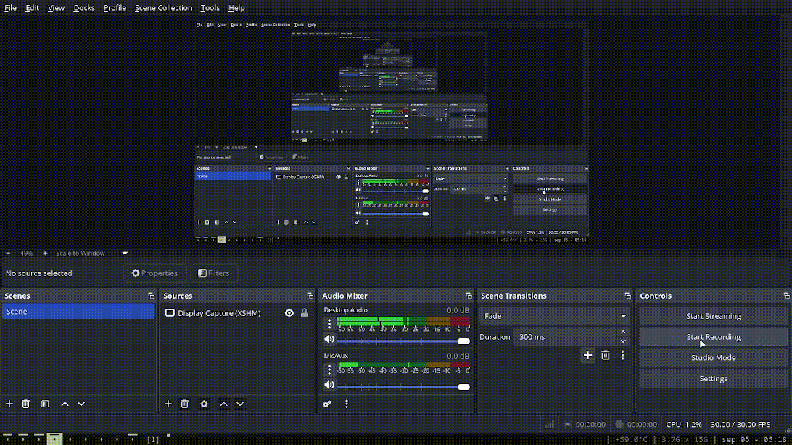

# Conway's game of life
You can get an idea [https://en.wikipedia.org/wiki/Conway%27s_Game_of_Life](here).

## Instalation
You should have SDL library installed.
``` bash
git clone --depth 1 https://github.com/EliasMouesca/GameOfLife.git
cd GameOfLife
make
```

## Usage
Run the main executable.

Press Space to start/stop/resume execution, press 1 through 5 to load an example or 0 to load an empty grid.

At any moment, click any cell to toggle it. And you can do it by steps too pressing the letter n.

## Config
The program automatically tries opening "config.txt" but you can pass a config as the first parameter of the program and it'll read that one instead.

### Configuration options
- **rows**: Number of rows the grid has
- **cols**: Number of columns the grid has
- **block_size**: Size in pixels of one side of the cells
- **fps**: Frames per second, 30 will do just fine, you can only notice it when moving the mouse.
- **delay**: Milliseconds the game takes to update the grid

## Galery




